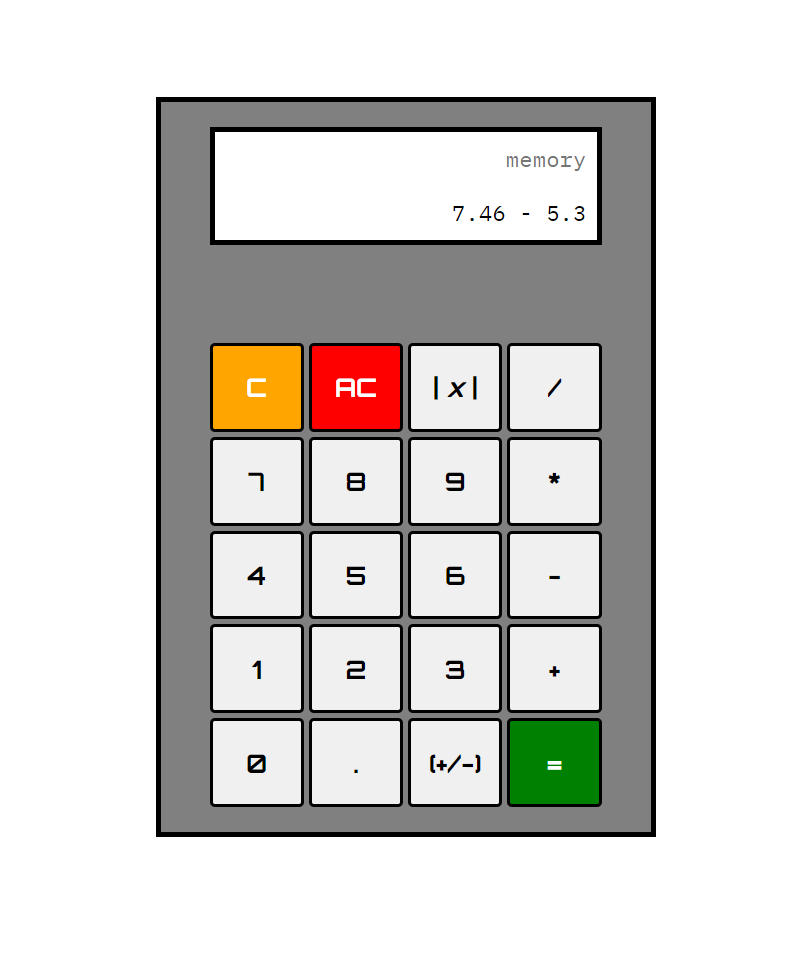

# About



While simple in its design, this calculator was an opportunity to refresh my skills in regular expression handling, working with ```localStorage```, and DOM manipulation in Javascript.
Some functionalities the calculator includes are:
  - Adding, subtracting, multiplying, and dividing on the basic input line as well as with a string stored to local memory
  * Calculating the absolute value of a number
  + Adding decimals with up to 3 values after
  - Switching the sign of a number from positive to negative or the other way around
  * The ability to clear the input line or clear all content (input line, memory, and localstorage)

# Getting Started

1. Download the files and store in a directory on your computer.
2. Copy the path to the index.html file in the directory.
3. Open your browser of choice.
4. Paste the path into your address bar.
5. Start Calculating!🤓

# To-Do

- [ ] Enhance accessibility by adding a colorblind mode
- [ ] Implement ability to do multiple operations on the memory input at a time


